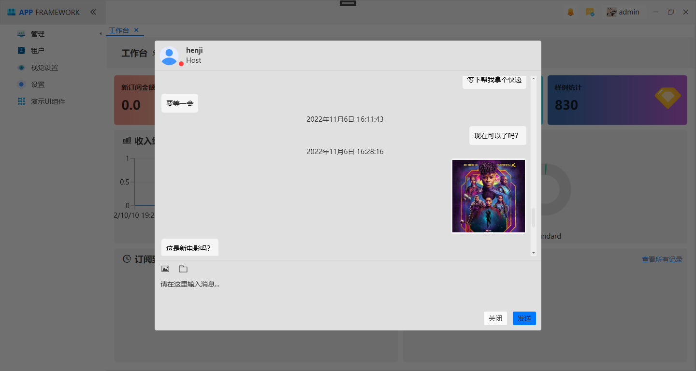
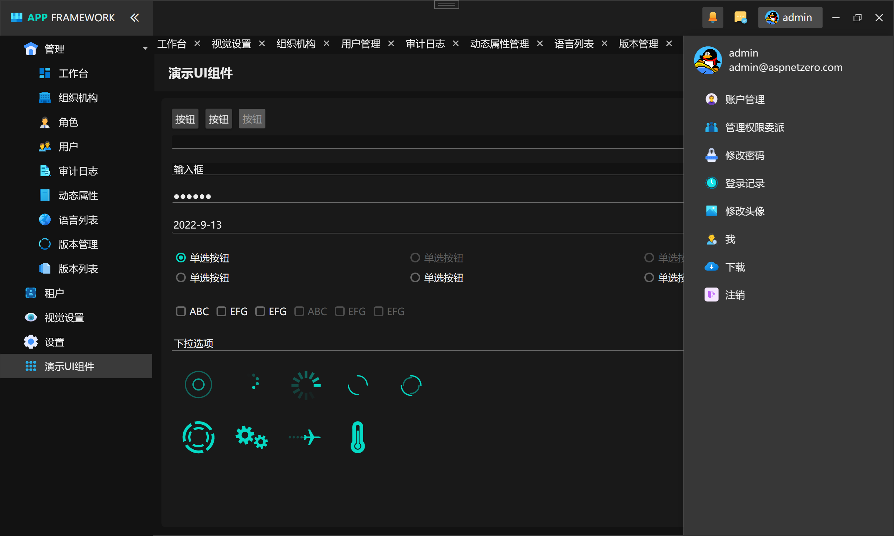
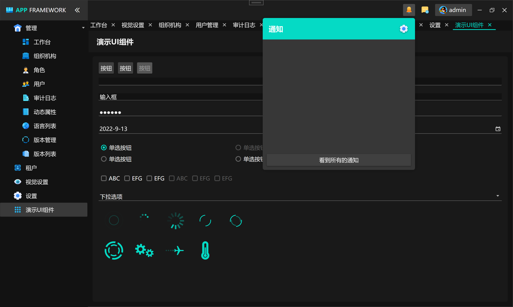

中文 | [English](./README-en.md)

MAUI 版本的 ABP框架   [点击查看](https://github.com/HenJigg/maui-abp)

## 亮点
本套WPF 框架支持多种UI框架, 包含: Syncfusion、HandyControl、MaterialDesign 。

参考更新: [WPF ABP框架重大更新(2022-12月份)](https://www.cnblogs.com/zh7791/p/16984326.html)

## 前言

本套框架基于ABP商业版框架进行完整开发, 实现了ABP商业版中的功能,  并且提供了WPF以及Xamarin.Forms版本,  实现完整的跨平台应用开发。

本套框架功能包含如下: 

- 用户与角色管理
- 组织机构
- 权限管理
- 多租户
- 即时通讯
- 本地化多语言
- 身份认证及授权
- 审计日志记录
- UI主题
- 异常处理
- 数据字典
- 系统设置

## 项目说明

ABP官方未正式提供完整版本WPF框架, 所以就出现了该套框架，来弥补市场的空白, 如果你是使用ABP框架的开发者,  那么你完全可以不费吹灰之力直接将本套系统接入到你们的系统业务当中。

并且ABP商业版中, 提供的Xamarin.Forms框架也是非常的简陋 , 所以本套框架也包含完整的Xamarin.Forms版本。 

## 项目授权

该存储库未包含完整的WPF以及Xamarin.Forms代码,  仅包含部分业务代码实现,  无法正常编译且运行, 如果您对相关商业授权感兴趣, 可以主动联系作者咨询, 添加请注明来意。

- QQ：779149549
- Email:  779149549@qq.com

**特别说明**:  本套框架的所有源代码仅需 499 

价格主要以你所在地区的货币为主, 举例: 你来自中国, 那么是499元, 如果你来自美国, 那么就是 499美元。 (一视同仁)

## 视频与文档

关于实际的运行效果图可以参考视频: [WPF ABP框架演示](https://www.bilibili.com/video/BV1Av4y1w7ds?spm_id_from=333.999.0.0)

下面通过一些实际运行的截图来展示效果, 包含桌面端(WPF)以及移动端(Xamarin.Forms)效果图。

## 更新历史记录

- [WPF ABP框架更新日志(最新2022-07月)](https://www.cnblogs.com/zh7791/p/16510567.html)
- [WPF ABP框架更新日志(最新2022-08月)](https://www.cnblogs.com/zh7791/p/16655799.html)
- [WPF ABP框架更新日志(最新2022-10月)](https://www.cnblogs.com/zh7791/p/16839052.html))
- [WPF ABP框架更新日志(最新2022-11月)](https://www.cnblogs.com/zh7791/p/16930333.html)
- [WPF ABP框架更新日志(最新2022-12月)](https://www.cnblogs.com/zh7791/p/16984326.html)

## 项目截图(部分)

#### WPF

- 登录页

- 首页

- 用户页

- 聊天页

  

- 角色页

- 审计日志

- 动态属性

- 多租户

- 版本列表

- 语言列表

- 系统设置

- 系统主题

#### Xamarin.Forms

- 登录页

- 首页

- 功能页

- 组织机构

- 角色页

- 用户页

- 审计日志页

- 动态属性页

- 租户页

- 版本管理

- 语言列表

- 主题切换

